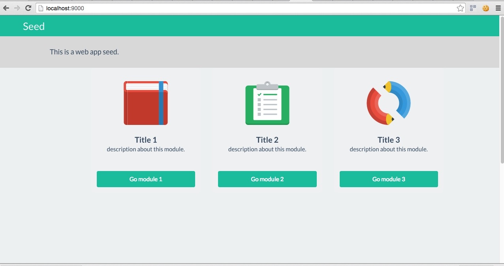
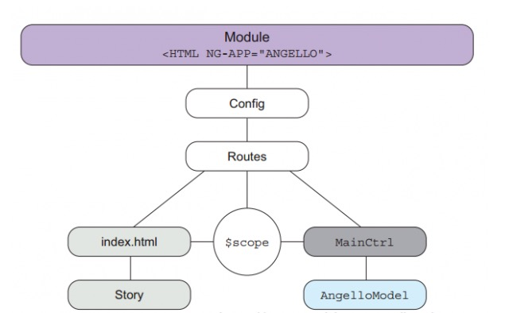

# Front-end seed

## Quick start
All Javascript and style packages are respectively managed by **[npm](https://www.npmjs.com/)** and **[bower](https://bower.io/)**.  

```bash
npm install
bower install // bower install --allow-root
gulp
```



### Add a new Page



Open /src/scripts/route.coffee ,add following code to create a new state.

```coffeescript
.state 'module1' 
,
  url: 'page1'
  templateUrl: '/modules/page1/index.html'
  controller: 'page1Ctrl'
```      
      
create your page(coffee,jade,less) in /src/modules/page1

    page1
    ├── index.ctrl.coffee
    ├── index.jade
    └── index.less
          
page1/index.ctrl.coffee:

```coffeescript    
angular.module 'Seed'
.classy.controller
  name: 'page1Ctrl'
  inject: [
    '$scope'
    '$rootScope'
    '$state'
  ]
  initScope: ->
    hello: 'This is a new page.'
  data: null
  init: -> null
  methods: null
```  
  
page1/index.jade:

```jade
.page1
  {{hello}}
```

page1/index.less:

```less
.page1 {
  text-align: center;
}
```

**Add page1's js file and css file to this app**

	src/modules/mod-index.jade:
		script(src='./modules/page1/index.ctrl.js')
	src/modules/mod-styles.less:
		@import "./page1/index";	
	  
Use **gulp** to build app, then open **http://localhost:9000/page1** in browser.

---
### View and Controller interaction via Angular

This front-end app is based on AngularJs. All features and functions of Angular are availble to use. See the **[Angular developer API reference](https://code.angularjs.org/1.4.0-rc.1/docs/api)**

**Coding in a simple and efficient way**, CoffeeScript, Jade and LessCSS are employed in this framework as a improved version of Javascript, Html and CSS.

* CoffeeScript <http://coffee-script.org/> 
* Jade <http://jade-lang.com/>
* LessCSS <http://lesscss.org/>

Here is an example:

1.Add these code in page1/index.jade:

```jade
.page1
  p {{hello}}
  label
    | Name:
    input(type='text',ng-model='user.name')
    button(ng-click='btnFunc()') Button
  p user.name = {{user.name}}
```
  
2.Create `btnFunc()` for the `Button` in page1/index.ctrl.coffee:

```coffeescript	
angular.module 'Seed'
.classy.controller
  name: 'page1Ctrl'
  inject: [
    '$scope'
    '$rootScope'
    '$state'
  ]
  initScope: ->
    hello: 'This is a new page.'
    user:
      name: null
  data: null
  init: -> null
  methods:
    btnFunc: () ->
      @scope.user.name = 'button clicked.'
```      

#### Structure of controller 
Angular Classy are employed to make controllers more structured and prescriptive. See more details on [Angular-classy](http://davej.github.io/angular-classy/).

* **name** : Controller unique name.
* **inject** : An array of all dependencies.	      
* **initScope** : All data present in the view layer [Not required]
* **data** : All data cached in controller 
* **init** : An init method for your initialization code.
* **methods** :  Controller methods are defined inside of the methods object.
	  
### Data exchange with backend via API

1.Run backend app in /back-end/

```bash	
python index.py	
```

test url <http://localhost:5000/api/testGET?test=123> in browser and you will get 

```json
	{"message": "success", "result": "123_GET_processed"}
```
	
2.add `testGET()` and `testPOST()` functions in src/scripts/services/api/user.coffee

```coffeescript
angular.module 'Seed'
.factory 'apiUserBase', [
  'Restangular'
  'CONFIG'
  (
    Restangular
    CONFIG
  ) ->
    baseURL = "#{CONFIG.BASEURL.API_SEED}"
    Restangular.withConfig (RestangularConfigurer) ->
      RestangularConfigurer.setBaseUrl baseURL
]
.factory 'apiUser', [
  'apiUserBase'
  'AUTH'
  (
    apiUserBase
    AUTH
  ) ->
    testGET: ->
      meta = apiUserBase.one 'api'
      .one 'testGET'
      new Promise (resolve, reject) ->
        meta.get()
        .then (result) ->
          resolve result
        , (res) ->
          reject res

   testPOST: ->
     meta = apiUserBase.one 'api'
     .all 'testPOST'
     new Promise (resolve, reject) ->
       meta.post()
       .then (result) ->
         resolve result
       , (res) ->
         reject res
]	
```	

* **Restangular** on [GitHub (Official Documentation)](https://github.com/mgonto/restangular) - AngularJS service to handle Rest API Restful Resources properly and easily
* 《AngularJS权威教程_AriLerner著_涵盖1.2.x_人民邮电出版社》 page 142 "15.13 使用 Restangular"
* testGET() and testPOST() return `new Promise(...)`.
* [**Promises**](http://bluebirdjs.com/docs/why-promises.html) are a concurrency primitive with a proven track record and language integration in most modern programming languages.
	
**Add API service file to this app**

	src/scripts/services/mod-index.jade:
		script(src="./scripts/services/api/user.js")
		
		
#### Inject API service into controller.

src/modules/page1/index.ctrl.coffee:

```coffeescript
angular.module 'Seed'
.classy.controller
  name: 'page1Ctrl'
  inject: [
    '$scope'
    '$rootScope'
    '$state'
    'apiUser'
  ]
  initScope: ->
    hello: 'This is a new page.'
    user:
      name: null
  data:
    apiUser: 'apiUser'
  init: -> null
  methods:
    btnFunc: () ->
      @$scope.user.name = 'button clicked.'
      
   callGET: (arg) ->
     Promise.bind @
     .then ->
       @apiUser.testGET arg
     .then (out)->
       @$scope.user.name = out.result
     .catch (err) ->
       console.log err

   callPOST: (arg) ->
     Promise.bind @
     .then ->
       @apiUser.testPOST arg
     .then (out)->
       @$scope.user.name = out.result
     .catch (err) ->
       console.log err
```       

* `apiUser: 'apiUser'` in `data` equals `this.apiUser = this.$scope.apiUser`
* `Promise.bind @` is the most efficient way of utilizing this with promises. 

		